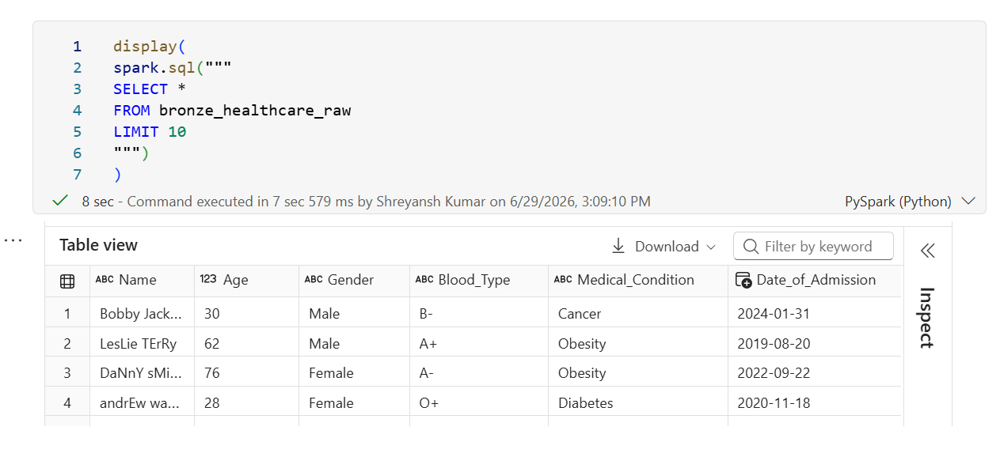
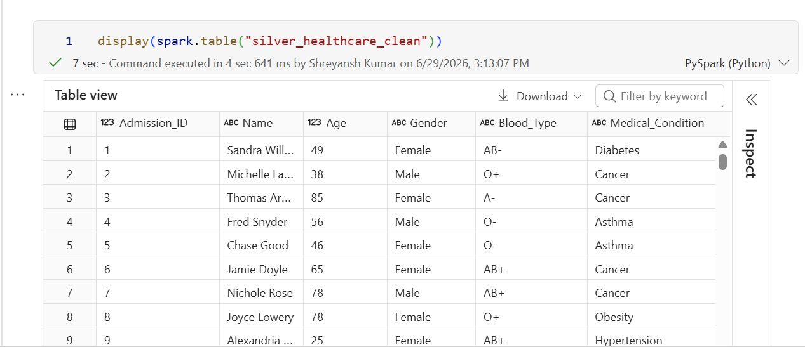
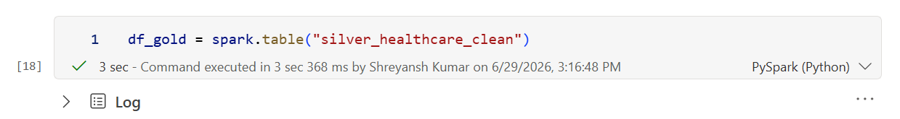
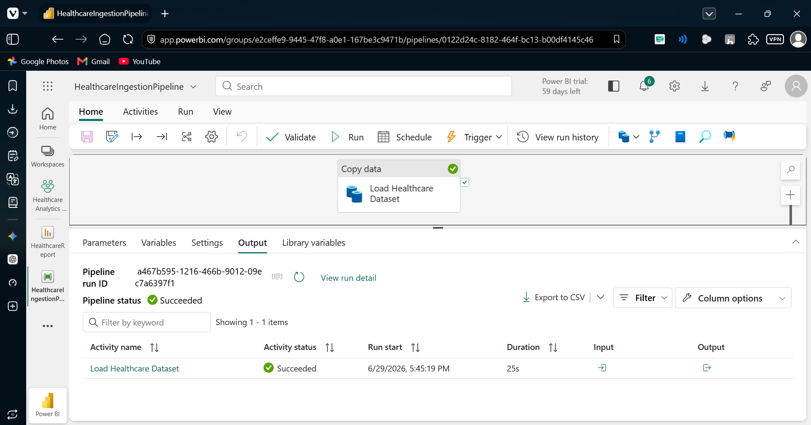
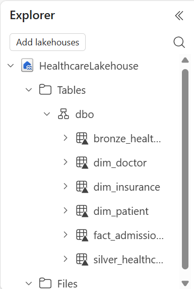
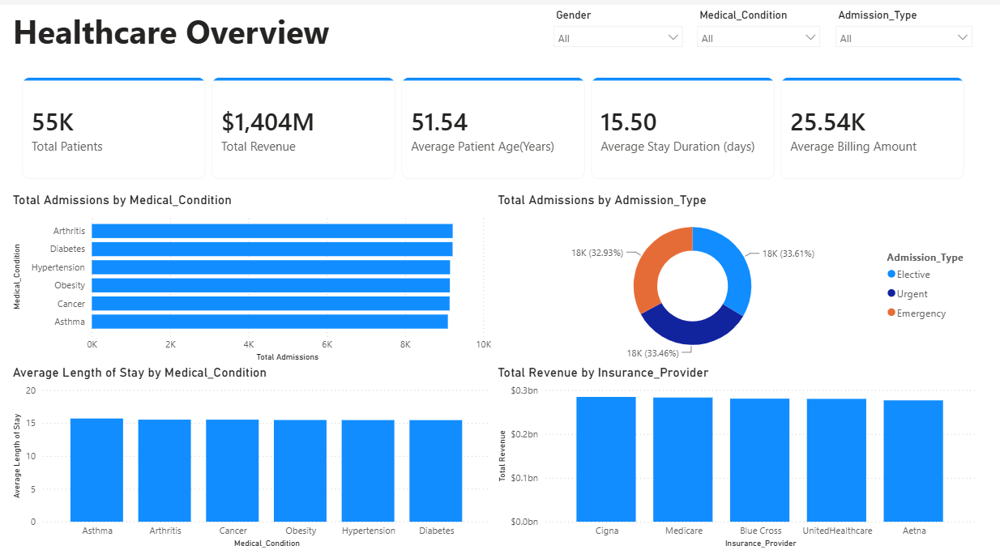

# Healthcare Analytics Platform using Microsoft Fabric

## Overview

This project demonstrates an end-to-end Healthcare Analytics Platform built using Microsoft Fabric. The solution ingests healthcare data into a Lakehouse, transforms it using PySpark notebooks, stores curated data in Delta tables, creates a semantic model, and visualizes healthcare insights through an interactive Power BI dashboard.

The project follows the Medallion Architecture (Bronze, Silver, Gold) to organize data processing and support analytical reporting.

---

### Data Flow

```text
Healthcare Dataset (CSV)
          │
          ▼
     Data Pipeline
          │
          ▼
   Healthcare Lakehouse
          │
    ┌─────┴─────┐
    ▼           ▼
 Bronze      Silver
   │            │
   └─────┬──────┘
         ▼
       Gold
         │
         ▼
   Semantic Model
         │
         ▼
 Healthcare Dashboard
```

---

## Technologies Used

- Microsoft Fabric
- OneLake
- Data Pipeline
- Lakehouse
- PySpark
- Delta Lake
- Semantic Model
- Power BI
- DAX

---

## Dataset

The project uses a healthcare dataset containing **55,501 patient admission records**.

### Key Attributes

- Patient Information
- Medical Conditions
- Hospital Information
- Insurance Providers
- Billing Amount
- Admission Details
- Medications
- Test Results

---

## Data Engineering Workflow

### Bronze Layer

Raw healthcare data was ingested into Delta format.

**Table:**
- `bronze_healthcare_raw`



---

### Silver Layer

Data cleansing and transformation layer.

Transformations performed:

- Standardized column names
- Removed duplicate records
- Generated `Admission_ID`
- Calculated `Length_of_Stay`
- Data validation and type handling

**Table:**
- `silver_healthcare_clean`



---

### Gold Layer

Dimensional model created for analytics and reporting.

#### Dimension Tables

- `dim_patient`
- `dim_doctor`
- `dim_hospital`
- `dim_insurance`

#### Fact Table

- `fact_admissions`



---

## Data Pipeline

A Microsoft Fabric Data Pipeline was implemented to automate ingestion of healthcare data into the Lakehouse.



---

## Lakehouse

The Lakehouse serves as the central storage layer for Bronze, Silver, and Gold data assets.



---

## Dashboard

### Healthcare Overview

#### KPIs

- Total Patients
- Total Revenue
- Average Patient Age
- Average Stay Duration (Days)
- Average Billing Amount

#### Visualizations

- Total Admissions by Medical Condition
- Total Admissions by Admission Type
- Average Stay Duration by Medical Condition
- Total Revenue by Insurance Provider

#### Interactive Filters

- Gender
- Medical Condition
- Admission Type



---

## Key Skills Demonstrated

- Data Ingestion
- ETL Development
- Data Engineering
- PySpark Transformations
- Delta Lake
- Data Modeling
- Semantic Modeling
- DAX
- Business Intelligence
- Microsoft Fabric

---

## Project Structure

```text
Healthcare-Analytics-on-Microsoft-Fabric/
│
├── README.md
├── notebooks/
│   └── HealthcareTransformations.ipynb
│
├── architecture/
│   └── architecture.png
│
└── screenshots/
    ├── dataRead.png
    ├── bronze.png
    ├── silver.png
    ├── gold.png
    ├── lakehouse.png
    ├── copyDataAct.png
    └── dashboard.png
```

---

## Author

**Shreyansh Kumar**  
B.Tech – Computer Science & Communication Engineering  
KIIT University
